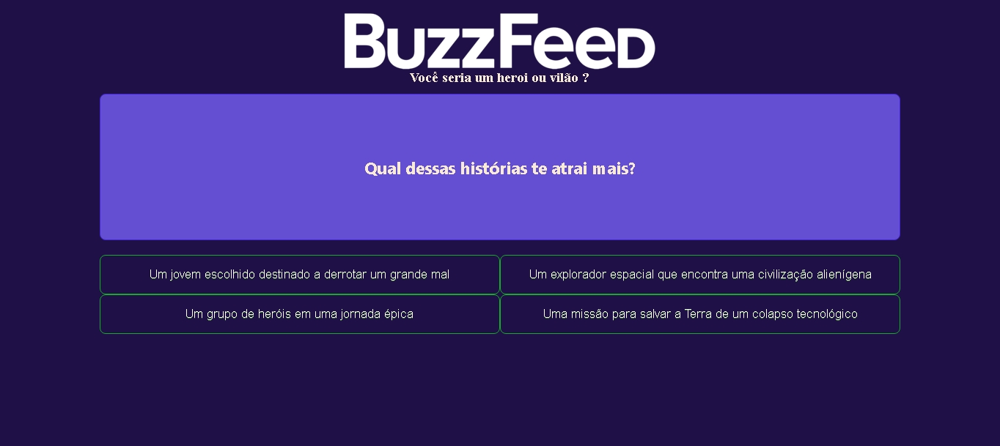

# BuzzFeed Clone - Quiz Interativo com Angular

## Sobre o Projeto

Este é um clone do popular site de perguntas e respostas **BuzzFeed**, desenvolvido utilizando o framework **Angular**. O objetivo do projeto é permitir que os usuários respondam a questionários interativos e recebam um resultado baseado em suas respostas, assim como no BuzzFeed original.

## Demonstração



## Funcionalidades

✅ Responder quizzes interativos<br>
✅ Exibição dinâmica de perguntas e opções de resposta<br>
✅ Cálculo automático do resultado baseado nas respostas<br>
✅ Interface intuitiva e responsiva<br>
✅ Estruturado com componentes reutilizáveis do Angular<br>

## Tecnologias Utilizadas

- **Angular**: Framework principal para a construção do front-end
- **TypeScript**: Linguagem utilizada para tipagem e melhor estruturação do código
- **HTML & CSS**: Para a estilização e estrutura das páginas
- **JSON**: Para armazenar as perguntas e respostas dos quizzes

## Como Rodar o Projeto

1️⃣ Clone este repositório:
```bash
  git clone https://github.com/BrunoHenriqueOliveira/projeto-buzzfeed
```

2️⃣ Acesse a pasta do projeto:
```bash
  cd buzzfeed-clone-angular
```

3️⃣ Instale as dependências:
```bash
  npm install
```

4️⃣ Inicie o servidor de desenvolvimento:
```bash
  ng serve
```

5️⃣ Acesse no navegador:
```
  http://localhost:4200/
```

## Melhorias Futuras

🔹 Opção para criação de novos quizzes pelo usuário<br>
🔹 Integração com um banco de dados para salvar resultados<br>
🔹 Animações e melhorias na UI/UX

## Licença

Este projeto está sob a licença MIT. Veja o arquivo [LICENSE](LICENSE) para mais detalhes.
